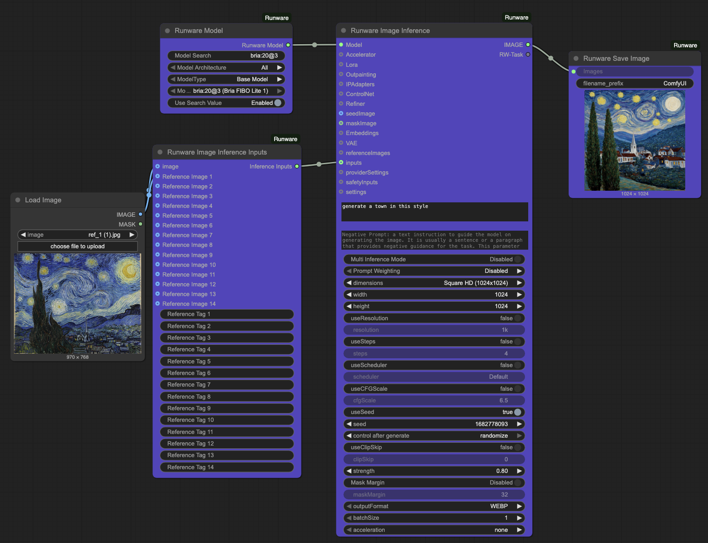
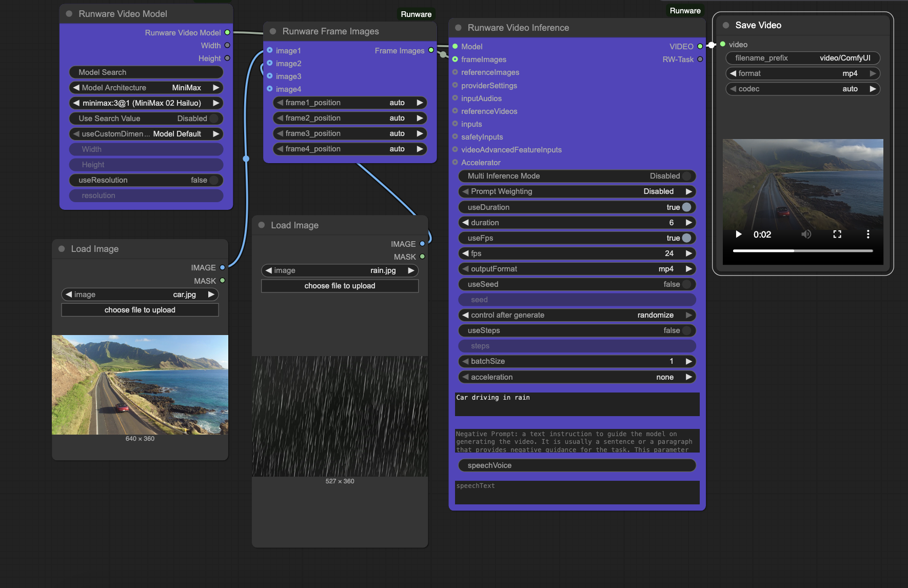

# ComfyUI-Runware Integration 🚀

Welcome to **ComfyUI-Runware**! 🌟 This is the official integration for **[Runware](https://runware.ai/?utm_source=github&utm_medium=referral&utm_campaign=comfyui)**, bringing you the power of **inference-as-a-service** directly into **ComfyUI**! 

## 🌟 What is ComfyUI-Runware?

Imagine creating stunning images or videos, refining details, or even removing backgrounds—all without needing a powerful GPU. With **Runware**, all the heavy lifting happens on our servers. No GPU? No problem! 🖥️💨 

This integration adds a suite of custom nodes to ComfyUI, allowing you to:
- Perform advanced image inference tasks, including image generation and editing with powerful models.
- Utilize PhotoMaker V2 pipelines
- Leverage cutting-edge image models like **Flux .1 Kontext Pro**, **Flux .1 Kontext Max**, **Nano Banana**, **Seedream**, and more for superior image generation and editing.
- Upscale images
- Remove backgrounds
- Generate videos from text prompts and/or images with video inference
- Generate audio from text
- Upscale videos
- Generate video captions
- Remove video backgrounds
- Leverage specialized models and LoRAs
- Use your custom uploaded models and LoRAs

... and so much more! Let’s make your workflows seamless and efficient with **Runware**. 🖌️✨

---

## 📖 Table of Contents

1. [Introduction](#-what-is-comfyui-runware)
2. [Workflows](#-workflows)
3. [Installation](#-installation)
4. [Node Features](#-node-features)
5. [Support & Community](#-support--community)

---

## 🎬 Workflows

Here are some example workflows showcasing the power of ComfyUI-Runware:

### Image Workflows


### Video Workflows


---

## 🔧 Installation

### Step 1: Install ComfyUI

First, ensure you have ComfyUI installed. You can follow the [pre-built package guide](https://docs.comfy.org/get_started/pre_package) or the [manual installation guide](https://docs.comfy.org/get_started/manual_install).

Make sure your system meets these requirements:
- **Python 3.10+**
- **ComfyUI installed**

### Step 2: Install ComfyUI-Runware

You have two options to install this integration:

#### Option 1: Using ComfyUI Manager (Recommended)
First, ensure you have the `ComfyUI-Manager` custom node installed. If you don't have it or are using the beta ComfyUI desktop version, follow the instructions on this [GitHub Repo](https://github.com/ltdrdata/ComfyUI-Manager?tab=readme-ov-file#installation).

After installing ComfyUI-Manager, open it and click on "Custom Nodes Manager". Search for "Runware" or **"Runware.ai"** and then click on install or update. Finally, restart your ComfyUI. ✨

#### Option 2: Manual Installation

1. Navigate to the custom nodes directory:
   ```bash
   cd custom_nodes
   ```

2. Clone the repository:
   ```bash
   git clone https://github.com/Runware/ComfyUI-Runware.git
   ```

3. Navigate to the repository folder:
   ```bash
   cd ComfyUI-Runware
   ```

4. Install dependencies:
   ```bash
   pip install -r requirements.txt
   ```

### Step 3: Run ComfyUI

Install latest ComfyUI frontend package
```bash
pip install -U comfyui-frontend-package
````

Start ComfyUI with the following command:
```bash
python main.py
```

#### Optional: CPU-Only Mode
If you want to run ComfyUI without a GPU, add the `--cpu` flag:
```bash
python main.py --cpu
```

### Step 4: Explore Workflows
Inside the `ComfyUI-Runware` custom node folder, you’ll find a `workflows` folder with pre-made workflows to get you started! 🚀

---

## 🧩 Node Features

Here's a breakdown of the amazing nodes included in this integration:

- **Runware API Manager**: Set or change your API keys, adjust the max connection timeout, adjust the image output quality and format, and enable or disable image caching directly in ComfyUI—no need to edit config files manually! 🔑
- **Runware Image Inference**: Perform advanced tasks like inpainting, outpainting, and more 🎨
- **Runware PhotoMakerV2**: Create consistent identities with our photomaker pipeline. 🖼️
- **Runware Image Upscale**: Upscale your images up to 4x. 🔍
- **Runware Background Removal**: Effortlessly remove image backgrounds. 🧹
- **Runware LoRA**: Search and select LoRAs to enhance your workflow. 📂
- **Runware Model**: Choose specific models to connect with image inference. 🤖
- **Runware ControlNet**: Guide your image generation with ControlNet and guide images. 🗺️
- **Runware Refiner**: Refine your images with advanced tools. ✨
- **Runware LoRA Combine**: Combine up to 3 LoRAs together. 🔗
- **Runware ControlNet Combine**: Combine multiple ControlNets for complex workflows. 🧩
- **Runware Image Masking**: Automatically mask elements like faces, hands, and more. 🖌️
- **Runware ControlNet Preprocessor**: Preprocess images before using them as guide images in ControlNet. 🔄
- **Runware VAE**: Search and connect a VAE to Image inference. 🖼️
- **Runware Embedding**: Search and connect Embedding to image inference. 🧩
- **Runware Embedding Combine**: Combine multiple embeddings together. 🔗
- **Runware Image Caption**: Generate descriptive text from images for further workflow integration. 🖼️
- **Runware IPAdapter**: Use reference images to guide the style and content of generated images. 🖌️
- **Runware IPAdapters Combine**: Combine multiple IP-Adapter inputs for sophisticated image conditioning. 🔗
- **Runware Video Inference**: Generate videos from text prompts using advanced AI models with support for frame images and reference images. 🎬

- **Runware Frame Images**: Configure keyframe images with precise positioning control for video generation. 🖼️➡️🎥
- **Runware Reference Images**: Provide reference images for overall visual guidance in video generation. 🖼️

### Provider Settings

Configure provider-specific settings for various services:
- **Runware Alibaba Provider Settings**: Configure Alibaba-specific settings. ☁️
- **Runware BRIA Image Provider Settings**: Configure BRIA Image-specific settings. 🖼️
- **Runware ByteDance Provider Settings**: Configure ByteDance-specific settings. 🎬
- **Runware ElevenLabs Provider Settings**: Configure ElevenLabs-specific settings for audio generation. 🎤
- **Runware Kling Provider Settings**: Configure Kling-specific settings. 🎥
- **Runware Lightricks Provider Settings**: Configure Lightricks-specific settings. ✨
- **Runware Luma Provider Settings**: Configure Luma-specific settings. 🎬
- **Runware Midjourney Provider Settings**: Configure Midjourney-specific settings. 🎨
- **Runware MiniMax Provider Settings**: Configure MiniMax-specific settings. 🤖
- **Runware OpenAI Provider Settings**: Configure OpenAI-specific settings with quality, background, and style options. 🤖
- **Runware Pixverse Provider Settings**: Configure Pixverse-specific settings with effect, style, motion, and sound options. 🎬
- **Runware Runway Provider Settings**: Configure Runway-specific settings. 🎥
- **Runware Vidu Provider Settings**: Configure Vidu-specific settings. 🎬

---

## 🤝 Support & Community

This is the **official Runware integration**, maintained by **Runware Inc**. We’re here to help you every step of the way! 💬

Join our community on Discord for support, updates, and to connect with fellow creators: [Runware Discord](https://discord.com/invite/aJ4UzvBqNU) 🎉

---

Thank you for using **ComfyUI-Runware**! Let’s create something amazing together. 🌟
